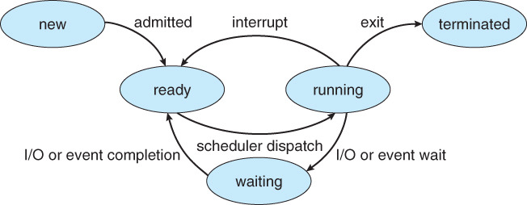

# 스케줄링 기법

# 1️⃣스케줄링

- CPU를 잘 사용하기 위해 프로세스를 잘 배정하기

## 조건

- 오버헤드 ↓
- 사용률 ↑
- 기아 현상 ↓

## 목표

1. Batch System : 가능하면 많은 일을 수행, 시간 보단 처리량이 중요
2. Interactive System : 빠른 응답시간 , 적은 대기 시간
3. Real-time System : deadline 맞추기

## 선점 / 비선점 스케줄링

- 선점 : CPU를 강제로 빼앗을 수 있는 방식
    - CPU가 어떤 프로세스에 의해 점유 중일 때, 우선 순위가 높은 프로세스가 CPU를 차지할 수 있음
    - 우선 순위가 높은 프로세스를 빠르게 처리해야할 경우 유용.
    - 선점이 일어날 경우, 오버헤드가 발생하며 처리시간을 예측하기 힘듦.
    - I/O요청, I/O응답, Interrupt발생, 작업완료 상황에서 발생

- 비선점 : 프로세스 종료 or I/O 등의 이벤트가 있을 때까지 실행 보장
    - 프로세스가 CPU를 점유하고 있다면 이를 빼앗을 수 없는 방식

# 프로세스

# CPU 스케줄링의 종류

- 비선점 스케줄링
    1. FCFS(First Come First Served)
        - 큐에 도착한 순서대로 CPU 할당
        - 실행 시간이 짧은게 뒤로 가면 평균 대기 시간이 길어짐
    2. SJF(Shortest Job First)
        - 수행시간이 가장 짧다고 판단되는 작업을 먼저 수행
        - FCFS 보다 평균 대기 시간 감소, 짧은 작업에 유리
        - 대기큐에서 영영 CPU를 할당받지 못한다 (기아현상 발생 우려)
    3. HRN(Hightest Response-ratio Next)
        - SJF+Aging 기법 합쳣다. 기아현상을 해결
        - 우선순위를 계산하여 점유 불평등을 보완한 방법
        - 우선순위=(대기시간+실행시간)/실행시간
    4. 우선순위 스케줄링
    - 정적/동적으로 우선순위를 부여하여 우선순위가 높은 순서대로 처리
    - 우선 순위가 낮은 프로세스가 무한정 기다리는 Starvation 이 생길 수 있음
    - Aging 방법으로 Starvation 문제 해결 가능
- 선점 스케줄링
    1. SRT
    2. Round Robin
        - FCFS에 의해 프로세스들이 보내지면 각 프로세스는 동일한 시간의 `Time Quantum` 만큼 CPU를 할달 받음
            - `Time Quantum` or `Time Slice` : 실행의 최소 단위 시간
        - 할당 시간(`Time Quantum`)이 크면 FCFS와 같게 되고, 작으면 문맥 교환 (Context Switching) 잦아져서 오버헤드 증가
    3. Multilevel-Queue (다단계 큐)

        

        - 작업들을 여러 종류의 그룹으로 나누어 여러 개의 큐를  이용하는 기법
        - 우선순위가 낮은 큐들이 실행못하는 걸 방지하고자 각 큐마다 다른 Time Quantum을 설정해주는 방식
        - 우선순위가 높은 큐는 작은 Time Quantum 할당. 우선순위가 낮은 큐는 큰 TIme Quantum 할당

    4. Multilevel-Feedback-Queue (다단계 피드백 큐)

        

        - 다단계 큐에서 자신의 Time Quantum 을 다 채운 프로세스는 밑으로 내려가고 자신의 Time Quantum을 다 채우지 못한 프로세스는 큐 그대로
        - 짧은 작업에 유리, 입출력 위주 작업에 우선권을 줌
        - 처리 시간이 짧은 프로세스를 먼저 처리하기 때문에 Turnaround 평균 시간을 줄여줌
        - 다 단계 큐 + 동적인 프로세스 우선 순위 변화 적용
        - *Time Quantum : 시간할당량
        - FCFS+라운드로빈기법 혼용
    5. SRT
        - 짧은 시간 순서대로 프로세스를 수행한다.

    ## MLQ와 MFQ 차이

    - MLQ 스케줄링의 경우 큐와 큐 사이에 프로세스들이 이동을 할 수 없는 반면 , MFQ 스케줄링의 경우 큐사이에 프로세스들이 이동 가능
    - MLQ보다 MFQ가 유연성이 좋다
    - MLQ는 하위 단계의 큐가 있을 수록 CPU 할당을 받지 못하여 기아현상이 발생할 수 도있지만 MFQ는 에이징 기법으로 기아 현상을 예방