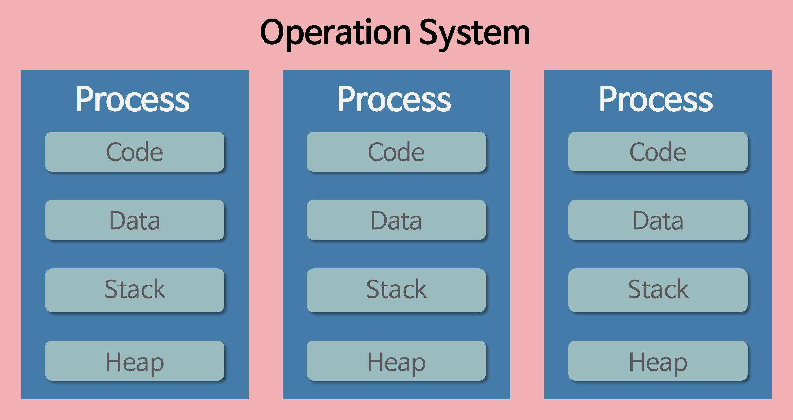

# 프로세스와 스레드

### 프로세스

- 컴퓨터에서 연속적으로 실행되는 프로그램(어떤 작업을 실행할 수 있는 파일)
- 메모리에 올라와 실행되고 있는 프로그램의 인스턴스(독립적인 개체)
- 운영체재로 부터 시스템 자원을 할당 받는 작업의 단위

- 특징
    - 기본적으로 프로세스 당 최소 1개의 스레드가 존재
    - 한 프로세스가 다른 프로세스의 자원에 접근하려면 프로세스 간의 통신(IPC, inter-process communication)을 사용해야 한다.
        - Ex. 파이프, 파일, 소켓 등을 이용한 통신 방법 이용

### 스레드

- 프로세스 내에서 실행되는 여러 흐름의 단위
- 프로세스의 특정한 수행 경로

- 특징
    - 한 프로세스 내의 공간이나 자원들은 같은 프로세스 내에 스레드끼리 공유하면서 실행된다.
    - 여러 스레드들은 같은 힙 공간을 공유한다.
    - 각각의 스레드는 별도의 레지스터와 스택을 갖고 있지만, 힙 메모리는 서로 읽고 쓸 수 있다.

## 멀티 프로세스와 멀티 스레드의 차이

### 멀티 프로세스

- 하나의 응용프로그램을 여러 개의 프로세스로 구성하여 각 프로세스가 하나의 작업을 처리
- 장점
    - 여러 개의 자식 프로세스 중 하나에 문제가 발생하면 그 자식 프로세스만 죽는 것 이상으로 다른 영향이 확산 X
- 단점
    - Context Switching 오버헤드
    - 프로세스 사이의 어렵고 복잡한 통신 기법(IPC)
        - 각각의 독립된 메모리 영역을 할당해서 하나의 프로그램에 속하는 프로세스들 사이의 변수를 공유 할 수 없다.!

### 멀티 스레드

- 하나의 응용 프로그램을 여러 개의 스레드로 구성하고 각 스레드로 하여금 하나의 작업을 처리
- 많은 운영체재들이 멀티 프로세싱을 지원하고 있지만 ***멀티 스레딩***을 기본!!

- 장점
    - 시스템 자원 소모 감소(자원의 효율성 증대)
    - 시스템 처리량 증가
    - 간단한 통신 방법으로 인한 프로그램 응답 시간 단축
- 단점
    - 주의 깊게 설계
    - 디버깅 어렵다
    - 다른 프로세스에서 스레드를 제어 X
    - 자원 공유 문제가 발생(동기화)
    - 하나의 스레드가 문제가 생기면 전체 프로세스가 영향을 받는다.

### 멀티 프로세스 대신 멀티 스레드를 사용하는 이유?

- 멀티 스레드??
    - 프로그램을 여러개 키는 것보다 하나의 프로그램 안에서 여러 작업을 해결하는 것!

    

- 왜 여러 프로세스로 할 수 있는데 멀티 스레드로 나눠서 하는 가??
1. 자원의 효율성 증대
    - 프로세스를 생성하여 자원을 할당하는 시스템 콜이 줄어든다.
    - → 프로세스간 Context Switching시 오버헤드가 크기때문!!?!
    - 스레드 간 데이터를 주고 받는 것이 간단해져서 시스템 자원 소모가 줄어든다.
2. 처리 비용 감소 및 응답 시간 단축
    - IPC보다 스레드 간의 통신 비용이 적으므로 작업들 간의 통신 부담이 줄어든다.
    - → 스레드는
    - 프로세스 간의 전환 속도보다 스레드 간의 전환 속도가 빠르다.
    - → Context Switch시 스레드는 Stack 영역만 처리하기 때문

## 동기화

[참고](https://woovictory.github.io/2018/12/26/OS-MultiThread-Concept/)

🥠동기화(process synchronization)

- 프로세스들이 서로 동작을 맞추는 것
- 프로세스들이 서로 정보를 공유하는 것

❓why

- 병행 수행중인 비동기적 프로세스들이 공유자원에 동시에 접근할때 문제 발생
- 경쟁 조건이 발생하면 공유자원을 신뢰할 수 없게 만들 수 있다. 이를 방지하기 위한 특별한 규칙

### 동기화 방법

✴️임계구역

- 멀티 프로세스 환경에서 둘 이상의 프로세스가 동시에 접근해서는 안되는 공유 자원의 코드 영역
- 임계구역에 접근하기 위해선 지정된 시간만큼 대기해야된다.
- 하나의 쓰레드가 임계구역에 접근하기 위해서는 요청->필요시 대기->임계구역 처리->빠져나간다 의 순서로 이루어진다.

1. 세마 포어

    

    - 멀티 프로그래밍 환경에서 공유 자원(임계구역)에 대한 접근을 제한하는 방법
2. Mutex(상호배제)

    

    - lock을 가진 스레드만이 임계구역에 접근할 수 있다.
    - 임계구역에서 작업이 끝난 스레드는 Unlock하여  lock반환

- 뮤텍스와 세마포어의 차이
    - 우리(프로세스), 방(자원)
    - 뮤텍스 : 방에 들어가기 위한 열쇠의 개수
        - 한 사람이 빈 방에 대한 열쇠를 가지고 들어가면 다른 사람은 그 사람이 나와야 들어갈 수 있다,
    - 세마포어는 빈 방의 열쇠의 개수
        - 방이 네개면 열쇠도 네개.. 아무나 먼저 나와야만 방과 열쇠를 한개씩  얻어 들어갈 수 있음.
1. 모니터

    `Q. 뮤텍스와 모니터의 차이는?`

    - 가장 큰 차이는 **뮤텍스**는 **다른 프로세스**(애플리케이션) 간에 동기화를 위해 사용한다. 반면에 **모니터**는 하나의 프로세스(애플리케이션)내에 **다른 쓰레드들 간**에 동기화를 위해 사용한다.
    - 또한, 뮤텍스는 보통 운영체제 커널에 의해서 제공되는 반면에 모니터는 프레임워크나 라이브러리 그 자체에서 제공된다.
    - 따라서 뮤텍스는 무겁고(heavy-weight) 느리며(slower) 모니터는 가볍고(light-weight) 빠르다(faster).

### 동기화 정리

1. 세마포어는 자원의 상태를 나타내는 일종의 변수(소유 개념 X)
뮤텍스는 자원을 점유한 프로세스나 스레드가 잠시 소유했다가 작업이 끝나면 반환
2. 뮤텍스는 동기화 대상이 자원의 하나 ., 세마포어는 하나이상 일때 사용

## 스레드와 프로세스 정리

- 프로세스는 컴퓨터에서 연속적으로 실행되고 있는 컴퓨터 프로그램(독립적인 개체) → 다른 프로세스의 자원에 접근하기 위해서는 IPC을 사용해야된다. 
ex) 카카오톡, 크롬, 등등
- 스레드는 프로세스 내에서 실행되는 여러 흐름의 단위
→ 각각의 레지스터와 스택을 갖고 있지만, 힙 영역은 공유한다.
ex)크롬 플로그인 , 인터넷 사용시 화면 캡처 방지
- 멀티 프로세스 : 하나의 응용프로그램을 여러 개의 프로세스로 구성하여 작업
    - Context Switching(여러 프로세스를 돌아가면서 작업을 처리하는 과정) 오버헤드
    - 프로세스 간의 복잡한 접근(IPC)
- 멀티 스레드 : 하나의 응용프로그램을 여러 개의 스레드로 구성하여 각 스레드로 하나의 작업을 처리
    1. 시스템 자원 소모 감소(자원의 효율성 증대)
    2. 시스템 처리량 증가
    3. 간단한 통신 방법으로 인한 프로그램 응답 시간 단축