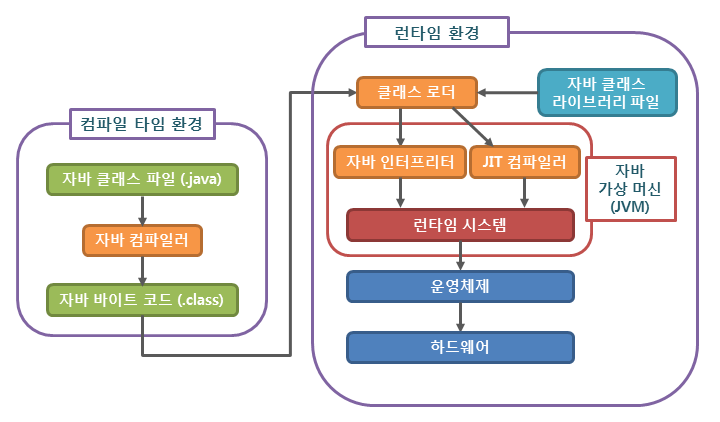

# 9주차 JAVA

## 객체지향

우리가 실생활에서 쓰는 모든 것을 객체라 하며, 객체 지향 프로그래밍은 프로그램 구현에 필요한 객체를 파악하고 각각의 객체들의 역할이 무엇인지를 정의하여 객체들 간의 상호작용을 통해 프로그램을 만드는 것을 말한다

### 특징

- 추상화
    - 객체들의 공통적인 특징(기능,속성)을 도출
    - 객체지향적 관점에서는 클래스를 정의하는 것을 추상화라고 할 수 있다.
- 캡슐화
    - 실제로 구현되는 부분을 외부에 드러나지 않도록 하여 정보를 은닉할 수 있다.
    - 객체가 독립적으로 역할을 할 수 있도록 데이터와 기능을 하나로 묶어 관리하는 것
    - 코드가 묶여있어서 오류가 없어 편리하다.
    - 데이터를 보이지 않고 외부와 상호작용을 할 때는 메소드를 이용하여 통신을 한다. 보통 라이브러리로 만들어서 업그레이드해 사용할 수 있다.
- 상속성
    - 하나의 클래스가 가진 특징(함수, 데이터)을 다른 클래스가 그대로 물려받는 것
    - 이미 작성된 클래스를 받아서 새로운 클래스를 생성하는 것
    - 기존 코드를 재활용해서 사용함으로써 객체지향 방법의 중요한 기능 중 하나에 속한다.
- 다형성
    - 약간 다른 방법으로 동작하는 함수를 동일한 이름으로 호출하는 것
    - 동일한 명령의 해석을 연결된 객체에 의존하는 것

### 장단점

- 장점
    - 소프트웨어의 생산성 향상 : 다형성, 객체, 캡슐화 등 소프트웨어의 재사용을 지향한다.
    - 보안성 향상 : 캡슐화 특징으로 정보 은닉
    - 실세계에 대한 쉬운 모델링
- 단점
    - 절차지향 프로그래밍에 비해 느린 실행 속도

## 자바의 특징

- 이식성이 높은 언어 (이식성 : 서로 다른 실행환경을 가진 시스템 간에 프로그램을 옮겨 실행할 수 있는 것)
- 객체지향 언어
- 함수적 스타일 코딩을 지원 (자바8부터 람다식 제공)⇒ 코드가 매우 간결해짐, 매핑 등
- 메모리를 자동으로 관리
- 다양한 애플리케이션 개발(윈도우 리눅스 유닉스 등에서 가능)
- 멀티쓰레드를 쉽게 구현 가능
- 동적 로딩을 지원
- 오픈 소스 라이브 풍부

## JAVA컴파일과정



1. 개발자가 자바 소스코드(.java)를 작성합니다.
2. 자바 컴파일러(Java Compiler)가 자바 소스파일을 컴파일합니다. 이때 나오는 파일은 자바 바이트 코드(.class)파일로 아직 컴퓨터가 읽을 수 없는 자바 가상 머신이 이해할 수 있는 코드입니다. 바이트 코드의 각 명령어는 1바이트 크기의 Opcode와 추가 피연산자로 이루어져 있습니다.
3. 컴파일된 바이크 코드를 JVM의 클래스로더(Class Loader)에게 전달합니다.
4. 클래스 로더는 동적로딩(Dynamic Loading)을 통해 필요한 클래스들을 로딩 및 링크하여 런타임 데이터 영역(Runtime Data area), 즉 JVM의 메모리에 올립니다.
    - 클래스 로더 세부 동작
        1. 로드 : 클래스 파일을 가져와서 JVM의 메모리에 로드합니다.
        2. 검증 : 자바 언어 명세(Java Language Specification) 및 JVM 명세에 명시된 대로 구성되어 있는지 검사합니다.
        3. 준비 : 클래스가 필요로 하는 메모리를 할당합니다. (필드, 메서드, 인터페이스 등등)
        4. 분석 : 클래스의 상수 풀 내 모든 심볼릭 레퍼런스를 다이렉트 레퍼런스로 변경합니다.
        5. 초기화 : 클래스 변수들을 적절한 값으로 초기화합니다. (static 필드)
5. 실행엔진(Execution Engine)은 JVM 메모리에 올라온 바이트 코드들을 명령어 단위로 하나씩 가져와서 실행합니다. 이때, 실행 엔진은 두가지 방식으로 변경합니다.
    1. 인터프리터 : 바이트 코드 명령어를 하나씩 읽어서 해석하고 실행합니다. 하나하나의 실행은 빠르나, 전체적인 실행 속도가 느리다는 단점을 가집니다.
    2. JIT 컴파일러(Just-In-Time Compiler) : 인터프리터의 단점을 보완하기 위해 도입된 방식으로 바이트 코드 전체를 컴파일하여 바이너리 코드로 변경하고 이후에는 해당 메서드를 더이상 인터프리팅 하지 않고, 바이너리 코드로 직접 실행하는 방식입니다. 하나씩 인터프리팅하여 실행하는 것이 아니라 바이트 코드 전체가 컴파일된 바이너리 코드를 실행하는 것이기 때문에 전체적인 실행속도는 인터프리팅 방식보다 빠릅니다.

## 추상클래스 와 인터페이스의 차이

### 추상 클래스

추상메서드를 선언하여 상속을 통해서 자손 클래스에서 완성하도록 유도하는 클래스

상속을 위한 클래스이기 때문에 객체 생성 X

동일한 부모를 가지는 클래스를 묶는 개념으로 상속을 받아서 기능을 확장시키는 것이 목적

단일 상속만 가능

선언했던 추상메서드를 무조건 구현해야된다.

### 인터페이스

다른 클래스를 작성하는데 도움을 주는 목적 

다중상속 가능

구현객체가 같은 동작을 한다는 것을 보장하는 것이 목적

### 공통점

둘다 선언만 있고 구현 내용은 없는 클래스

인스턴스화 불가능

### 차이점

인터페이스는 구현객체가 같은 동작

추상클랫느느 상속을 받아서 기능을 확장

## 제너릭 타입

제네릭(generic)이란 **데이터의 타입(data type)을 일반화한다(generalize)는 것**

이전에는 Object 타입을 이용하여 다시원하는 타입으로 타입변환을 해야했다. 이때 오류가 발생하는 가능성도 존재

- 사용해야하는 이유

    잘못된 타입이 사용될 수 있는 문제를 컴파일 과정에서 제거할 수 있기 때문

### 장점

1. 클래스나 메소드 내부에서 사용되는 객체의 타입 안정성을 높일 수 있습니다

2. 반환값에 대한 타입 변환 및 타입 검사에 들어가는 노력을 줄일 수 있습니다.

## 직렬화


- 자바 시스템 내부에서 사용되는 Object 또는 Data를 외부의 자바 시스템에서도 사용할 수 있도록 byte 형태로 데이터를 변환하는 기술 .
- JVM(Java Virtual Machine 이하 JVM)의 메모리에 상주(힙 또는 스택)되어 있는 객체 데이터를 바이트 형태로 변환하는 기술

### 역직렬화

- byte로 변환된 Data를 원래대로 Object나 Data로 변환하는 기술을 역직렬화(Deserialize)라고 부릅니다.
- 직렬화된 바이트 형태의 데이터를 객체로 변환해서 JVM으로 상주시키는 형태.

### 직렬화를 왜 사용해?

각자 PC의 OS마다 서로 다른 가상 메모리 주소 공간을 갖기 때문에, Reference Type의 데이터들은 인스턴스를 전달 할 수 없다.

따라서, 이런 문제를 해결하기 위해선 주소값이 아닌 Byte 형태로 직렬화된 객체 데이터를 전달해야 한다.

### 어디서 사용?

서블릿 세션

캐시

자바 RMI

## Casting

기본형의 캐스팅  : **데이터 손실을 막기** 위해서 동작

참조형의 캐스팅 : 서로 관련이 있는 데이터끼리의 변환을 목표 → 상속이나 구현 관계등에 있어야 캐스팅함

### 업 캐스팅

- 자식 클래스의 객체가 부모 클래스의 객체로 캐스팅
- 업캐스팅된 객체는 자식 객체만 가지고 있는 멤버에는 접근이 불가능

### 다운 캐스팅

- 업캐스팅되어 고유의 특성을 잃은 자식 클래스의 객체를 다시 복구시키는것

```java
Animal animal = new Animal();
animal.name = "Lulu";
animal.age = 3;
Dog dog = animal; // 컴파일 에러
System.out.println(dog.breed); // 컴파일 에러

Animal animal = new Dog();
animal.name = "Lulu";
Dog dog = (Dog)animal; // (캐스팅할 객체타입)캐스팅할 객체
dog.breed = "보더콜리"; // 가능
```

[헷갈리는 자바1: 캐스팅(Casting)](https://medium.com/@plantstoen/%EC%95%8C%EC%95%84%EB%91%90%EB%A9%B4-%EC%93%B8%EB%AA%A8%EC%9E%88%EB%8A%94-%EC%9E%90%EB%B0%94%EC%9D%98-%ED%97%B7%EA%B0%88%EB%A6%AC%EB%8A%94-%EC%A0%90-1-26b1e1a35491)

## 가비지 컬렉션

사용하지 않는 객체는 메모리에서 삭제하는 작업

- GC는 힙 메모리만 다룬다..
- GC의 대상
    1. 객체가 Null 인경우
    2. 블럭 실행 종료 후 ,블럭안에서 생성된 객체
    3. 부모 객체가 Null인 경우 , 포함하는 자식 객체

### 메모리 해제 과정

1.  Marking
    - 프로세스는 마킹을 호출합니다. 이것은 GC가 메모리가 사용되는지 아닌지를 찾아냅니다.
2. Normal Deletion
    - 참조되지 않는 객체를 제거하고, 메모리를 반환합니다.
3. Compaction
    - 퍼포먼스를 향상시키기 위해, 참조되지 않는 객체를 제거하고 또한 남은 참조되어지는 객체들을 묶는다. 이들을 묶음으로서 공간이 생기므로 새로운 메모리 할당시에 더 쉽고 빠르게 진행

### Generational Gabage Collection


1. Young 영역

    새롭게 생성한 객체의 대부분이 여기에 위치합니다. 대부분의 객체가 금방 접근 불가능 상태가 되기 때문에 매우 많은 객체가 Young 영역에 생성되었다가 사라집니다. 이 영역에서 객체가 사라질때 Minor GC 가 발생한다고 말합니다.

2. Old 영역

    접근 불가능 상태로 되지 않아 Young 영역에서 살아남은 객체가 여기로 복사됩니다. 대부분 Young 영역보다 크게 할당하며, 크기가 큰 만큼 Young 영역보다 GC는 적게 발생합니다. 이 영역에서 객체가 사라질 때 Major GC(혹은 Full GC) 가 발생한다고 말합니다.

3. Permanet 영역

    Method Area라고도 합니다. JVM이 클래스들과 메소드들을 설명하기 위해 필요한 메타데이터들을 포함하고 있습니다. JDK8부터는 PermGen은 Metaspace로 교체됩니다.

### GC 과정

1. 어떠한 새로운 객체가 들어오면 Eden Space에 할당
2. Eden space가 가득차게 되면, minor garbage collection이 시작됩니다
3. 참조되는 객체들은 첫번째 survivor로 이동되어지고 비 참조 객체는 Eden space가 clear될때 반환 
4. 다음 minor GC 때, Eden space에서는 같은 일이 일어납니다. 비 참조 객체는 삭제되고 참조 객체는 survivor space로 이동하는 것 입니다. 그러나 이 케이스에서 참조 객체는 두 번째 survivor space로 이동하게 됩니다. 게다가 최근 minor GC에서 첫 번째 survivor space로 이동된 객체들도 age가 증가하고 S1 공간으로 이동하게 됩니다. 한번 모든 surviving 객체들이 S1으로 이동하게 되면 S0와 Eden 공간은 Clear 됩니다.
5. 다음 minor GC 때, 같은 과정이 반복 됩니다. 그러나 이 번엔 survivor space들은 switch 됩니다. 참조되는 객체들은 S0로 이동합니다. 살아남은 객체들은 aged되죠. 그리고 Eden과 S1 공간은 Clear 됩니다.
6. minor GC 후 aged 오브젝트들이 일정한 age threshold(문지방)을 넘게 되면 그들은 young generation에서 old로 promotion 되어집니다. 여기서는 8을 예로 들었습니다.
7. minor GC가 계속되고 계속해서 객체들이 Old Generation으로 이동됩니다.
8. 아래 그림은 전 과정을 보여주고 있습니다. 결국 major GC가 old Generation에 시행되고, old Generation은 Clear 되고, 공간이 Compact 되어집니다.

    

## Overloading Overrriding

- 오버라이딩(Overriding) - 부모클래스의 메소드와 같은 이름을 사용하며 매개변수도 같되 내부 소스를 재정의하는 것
- 오버로딩(Overloading) - 같은 이름의 함수를 여러 개 정의한 후 매개변수를 다르게 하여 같은 이름을 경우에 따라 호출하여 사용하는 것

## 클래스, 객체, 인스턴스 개념

### 클래스

- 개념

    객체를 정의하고 만들어 내기 위한 설계도 혹은 틀

    연관되어 있는 변수와 메서드의 집합

- 특징

    객체의 상태를 나타내는 필드와 객체의 행동을 나타내는 메소드

### 객체

- 개념

    소프트웨어 세계에 구현할 대상

    클래스에 선언된 모양 그래도 생성된 실체

- 특징

    클래스의 인스턴스

### 인스턴스

- 개념

    설계도를 바탕으로 소프트웨어 세계에 구현된 구체적인 실체

    → 객체를 소프트웨어에 실체화하면 그것을 인스턴스

    실체화된 인스턴스는 메모리에 할당

- 특징

    인스턴스는 객체에 포함된다고 볼 수 있다.


## 질문

최 

1. 직렬화에 대해서 알려주세요
    1. 역직렬화를 했을 때 문제
2. **혹시 싸피에서 자바를 사용했다고하는데 자바언어에 대한 특징들을 알려주세요**
    1. 객체지향의 특징
3. 타입 캐스팅에 대해서

한

1. **오버라이딩 오버로딩**
    1. 오버로딩 리턴이 다르다면
    2. 상속
2. 추상클래스와 인터페이스의 차이
    1. 인터페이스는 추상메서드만 가능하나??
3. GC에 관해서
    1. Stop-the-world

봉

1. 제너릭 타입에 대한 공부가 필요하다.
2. 좀더 임팩트있는 대답을 해야된다.
3. 의문문

김(목소리 차분)굳

1. 자바와 다른 언어와의 차이
    1. 객체지향의 단점
    2. 원시 타입
    3. 추상화
2. 자바의 컴파일과정
    1. 바이트코드
    2. 클래스로더
3. 제너릭 타입